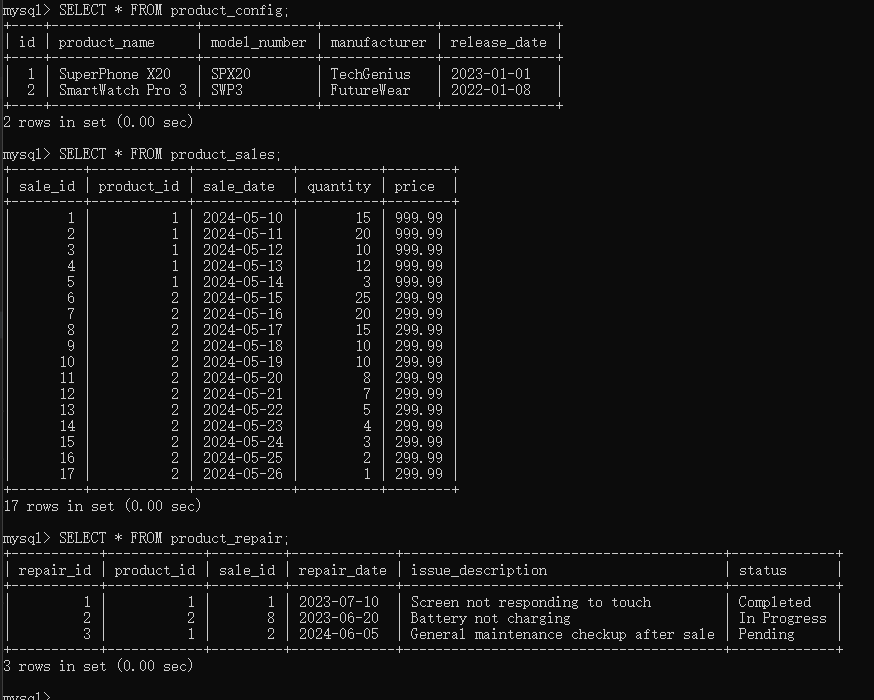

# 介绍
题目：
    通过框架+大模型实现数据库的查询及分析
需求：
    1、需要实现通过自然语言对数据库中数据的查询及分析
    2、数据库中需要存储多张相关联的表，比如产品配置表+产品售卖表+产品售后维修表
    3、实现通过自然语言对单表查询，多表联查，复杂查询，归因分析等，例如：获得某天的销售额，哪款产品更加畅销，各款产品的质量和维修率怎么样。。。
选型：
    1、框架可以使用langchain 、DB-GPT或者其他更好的框架
    2、大模型可以选取在线的和一个可以本地部署的7B的模型
    3、数据库可以选取sqlite，mysql等
# 思路
    通过自然语言向LLM提问，形成query语句，通过sql语句查询数据库，返回结果给LLM，LLM给出回答。
    question--->LLM--->query 语句--->sql--->mysql--->answer
    本题使用langchain的SQLDatabaseChain可以让LLM直接通过自然语言向数据库提问，无需编写SQL语句。
    基于该思路，LLM使用在线gptAPI和本地chatGLM-6B实现。

# 环境
```bash
pip install langchain langchain-experimental pymysql
pip install protobuf transformers==4.27.1 cpm_kernels
pip install torch
pip install -U langchain-community
```


# 创建本地mysql数据库
创建一个数据库
```sql
CREATE DATABASE product_system;
```

选择数据库
```sql
USE product_system;
```

创建产品配置表 (product_config)
```sql
CREATE TABLE product_config (
    id INT AUTO_INCREMENT PRIMARY KEY,
    product_name VARCHAR(255) NOT NULL,
    model_number VARCHAR(100),
    manufacturer VARCHAR(255),
    release_date DATE
);
```

创建产品售卖表 (product_sales)
```sql
CREATE TABLE product_sales (
    sale_id INT AUTO_INCREMENT PRIMARY KEY,
    product_id INT,
    sale_date DATE,
    quantity INT,
    price DECIMAL(10, 2),
    FOREIGN KEY (product_id) REFERENCES product_config(id)
);
```
这里，product_id是外键，关联到product_config表的id，表示每个销售记录都对应一个产品配置。

```sql
CREATE TABLE product_repair (
    repair_id INT AUTO_INCREMENT PRIMARY KEY,
    product_id INT,
    sale_id INT,
    repair_date DATE,
    issue_description TEXT,
    status ENUM('Pending', 'In Progress', 'Completed', 'Cancelled'),
    FOREIGN KEY (product_id) REFERENCES product_config(id),
    FOREIGN KEY (sale_id) REFERENCES product_sales(sale_id)
);
```
在product_repair表中，product_id和sale_id都是外键，分别关联到product_config和product_sales表，确保了维修记录与具体的产品配置和销售记录相关联。

向product_config表插入数据
```sql
INSERT INTO product_config (product_name, model_number, manufacturer, release_date)
VALUES 
('SuperPhone X20', 'SPX20', 'TechGenius', '2023-01-01'),
('SmartWatch Pro 3', 'SWP3', 'FutureWear', '2022-01-08');
```

向product_sales表插入数据
```sql
INSERT INTO product_sales (product_id, sale_date, quantity, price)
VALUES
(1, '2024-05-10', 15, 999.99),
(1, '2024-05-11', 20, 999.99),
(1, '2024-05-12', 10, 999.99),
(1, '2024-05-13', 12, 999.99),
(1, '2024-05-14', 3, 999.99),
(2, '2024-05-15', 25, 299.99),
(2, '2024-05-16', 20, 299.99),
(2, '2024-05-17', 15, 299.99),
(2, '2024-05-18', 10, 299.99),
(2, '2024-05-19', 10, 299.99),
(2, '2024-05-20', 8, 299.99),
(2, '2024-05-21', 7, 299.99),
(2, '2024-05-22', 5, 299.99),
(2, '2024-05-23', 4, 299.99),
(2, '2024-05-24', 3, 299.99),
(2, '2024-05-25', 2, 299.99),
(2, '2024-05-26', 1, 299.99);
```

向product_repair表插入数据
```sql
INSERT INTO product_repair (product_id, sale_id, repair_date, issue_description, status)
VALUES 
(1, 1, '2023-07-10', 'Screen not responding to touch', 'Completed'),
(2, 8, '2023-06-20', 'Battery not charging', 'In Progress'),
(1, 2, '2024-06-05', 'General maintenance checkup after sale', 'Pending');
```

查看一下数据库
```sql
SELECT * FROM product_config;
SELECT * FROM product_sales;
SELECT * FROM product_repair;
```


